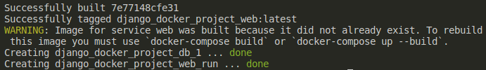
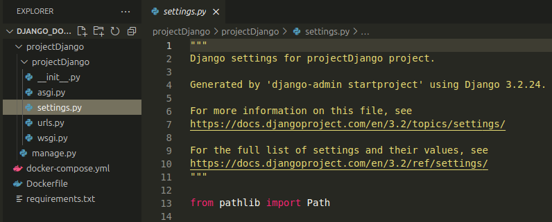
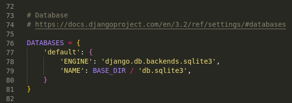
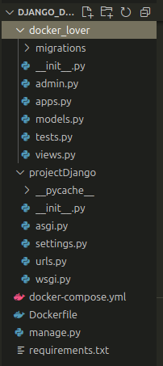

# Creating a Docker Container for a Django System
> Para versão em português, clique [aqui](https://github.com/fdtschmitz/Django_Docker_Project/blob/main/README.md)

### Why should I create a container for my apps?

For those who are starting, Docker allows you to package your application into standardized containers. This ensures that your application runs smoothly, regardless of the operating system it is running on. Moreover, containers are lightweight, allowing you to scale your application whenever needed. It is possible to run multiple containers in parallel. And with the help of Docker tools, you can manage your containers and automate the deployment of your applications.

Best of all, your applications will run more securely and isolated from each other. With containers, you can be confident that your application is running in a controlled environment, avoiding any potential conflicts or security issues.

### Requirements
To follow along with this article, you will need to install the following software:

- Docker Engine - version 25.0.3
    - Follow the step-by-step guide using the [official documentation](https://docs.docker.com/engine/) for installation.
- Docker Compose - version 2.24.6
    - Follow the step-by-step guide using the [official documentation](https://docs.docker.com/compose/install/) for installation.

Additionally, you will need a code editor and access to the Terminal. In this article, VSCode running on the Ubuntu 23.10 operating system was used.

### Initial Setup

Initially, a directory for our project called "Django_Docker_Project" was created and opened using VSCode.

With VSCode open, create a file named "Dockerfile." In this file, use the following code:

```docker
# Specifies the base image
FROM python:3
# Defines the environment
ENV PYTHONUNBUFFERED=1
# This will be the directory where our project will run
WORKDIR /code
# Copies the project's dependency file to the directory
COPY requirements.txt /code/
# Installs the dependencies from the file
RUN pip install -r requirements.txt
# Copies files from the root to the directory
COPY . /code/ 
```

Once done, create the "requirements.txt" file in the project's root and add the following code:

```bash
# Inform the version of Django to be installed.
# In this case, greater than 3.0 and less than 4.0
Django>=3.0,<4.0
```

Now create another file called "docker-compose.yml". This file describes the services that make up your app. In this example, we have two types of services: Web Server and Database. This file will then specify which images these services use and how they are connected. Use the following code:

```yaml
version: "3.9"

# Specify the services required for the container
services:
# Select the Postgres database
# Also inform the environment variables
  db:
    image: postgres
    environment:
        - POSTGRES_DB=postgres
        - POSTGRES_USER=postgres
        - POSTGRES_PASSWORD=postgres
# Create the web environment using localhost on port 8000
# Also specify the folder where the app code is located
# And add the dependency on the db service
  web:
    build: .
    command: python manage.py runserver 0.0.0.0:8000
    volumes:
      - .:/code
    ports:
      - "8000:8000"
    depends_on:
      - db
  
# Note: Django natively uses SQLite as the database.
# Therefore, after creating the project, it will be necessary to
# change the configuration file to use Postgres.
```

Your project should look like this:


### Creating the Django Project

With the YAML file created, the next step is to create the Django project using the configured image. In the terminal, execute the following command.

```bash
# Replace "projectDjango" with the name of your project
docker-compose run web django-admin startproject projectDjango .
```

>  Note the space and a dot at the end of the command. This represents the root installation of the project directory. If not included, Docker will create a new folder for this project.

During this process, the docker-compose will download the project's images and dependencies. Upon completion of the script, you should see the following message in the terminal:



Now, in the root directory, the "projectDjango" directory is present, containing the project files. As mentioned earlier, it will be necessary to configure the Postgres database. To do this, open the "settings.py" file, located inside the projectDjango directory.



Look for “DATABASES” constant, which should be in this format:



You will need to modify the code as follows:

```python
DATABASES = {
    'default': {
        'ENGINE': 'django.db.backends.postgresql',
        'NAME': 'postgres',
        'USER': 'postgres',
        'PASSWORD': 'postgres',
        'HOST': 'db',
        'PORT': 5432,
    }
}
```

Once done, save the file and go back to the Terminal to run the first test of the project you just created. Use the following command:

```bash
docker-compose up
```

It is likely that the following error will appear during execution:


This means that the "psycopg2" module is missing. To fix this, you need to install the dependency and update the Docker image. In the terminal, press Ctrl+C to stop the application.

Open the "requirements.txt" file and include the following dependency below Django:

```python
# Inform the version of Django to be installed.
# In this case, greater than 3.0 and less than 4.0
# Also install the psycopg2 module
Django>=3.0,<4.0
psycopg2-binary>=2.8
```

Now, update the image with the missing module. In the Terminal, use:

```python
docker-compose build
```

After the update, if everything goes well, you should see the following message in the Terminal:


>  Any changes you make to the project will require updating the Docker image. To do this, use the command "docker-compose build" as presented.

### Testing the application

In the Terminal use the following command:

```bash
docker-compose up
```

If everything is okay, you should see the following message:


This means that the Django server is running and accessible at [http://localhost:8000/](http://localhost:8000/). By accessing the link, you can confirm that the installation was successful.


> 🐳 It's important to mention that this application is running inside a Docker container and being accessed through port 8000, as configured.

### Creating an App in Docker

Press Ctrl+C in the Terminal to shut down the server. Now, similar to what was done at the beginning of the article, use docker-compose to create an app for the server. Still in the Terminal, use the following script:

```bash
# Replace "docker_lover" with the name of your app
docker-compose run web python manage.py startapp docker_lover
```

You will see a new directory in the root of the project with the name of your app.



You will need to make some modifications to the app. Inside the directory of your app, create a directory called "templates". Inside this directory, create a file named "index.html". In this file, use the following structure:

```html

<!DOCTYPE html>
<html lang="en">

<head>
    <meta charset="UTF-8">
    <meta name="viewport" content="width=device-width, initial-scale=1.0">
    <title>Docker App</title>
</head>

<body>
    <u1>
        <h1>I'm a docker lover!</h1>
        <h2>🐳 🐳 🐳 🐳 🐳</h2>
        <h3>I'm kidding, just testing an app 😜</h3>
    </u1>
</body>

</html>
```

Save and close the file. Open the "views.py" file in the directory of your app and include the following code:

```python
from django.shortcuts import render

# Create your views here.
def index(request):
    return render(request, "index.html")
```

In the same directory, create a file called "urls.py" and add the following code:

```python
from django.urls import path
from . import views

urlpatterns = [
    path("", views.index)
]
```

Once done, open the "settings.py" file in the Django project directory. Look for the "INSTALLED_APPS" constant and include the newly created app, as follows:

```python
INSTALLED_APPS = [
    'django.contrib.admin',
    'django.contrib.auth',
    'django.contrib.contenttypes',
    'django.contrib.sessions',
    'django.contrib.messages',
    'django.contrib.staticfiles',
    'docker_lover',
]
```

Still in the same directory, open the "urls.py" file and include inside the "urlpatterns" variable as follows. Don't forget to add the import statement for the "include" module. It should look like this:

```python
from django.contrib import admin
from django.urls import path
from django.urls import include

urlpatterns = [
    path('admin/', admin.site.urls),
    path('', include('docker_lover.urls')),
]
```

Save all the files to update the project's image again. This time, along with the update, the app will be executed. In the Terminal, use the command:

```python
docker-compose up --build
```

With the server active, access [http://localhost:8000/](http://localhost:8000/) again. If everything is correct, you should see your app running successfully on the server:


### Conclusion

In this article, we covered how to create a Docker container for a Django system. You can access the files for this article on my [Github](https://github.com/fdtschmitz/Django_Docker_Project).

The power and versatility of using containers for applications are undeniable. I hope this article is useful in some way and can contribute to your studies.
