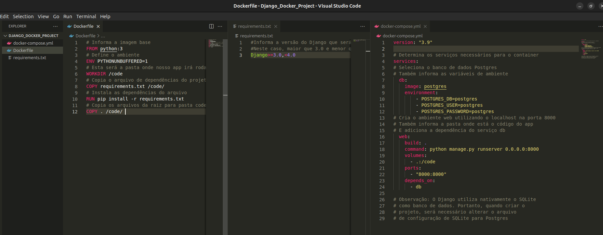
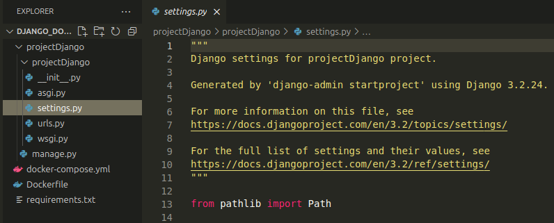
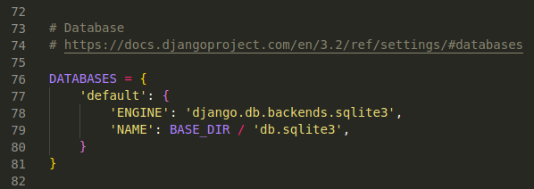
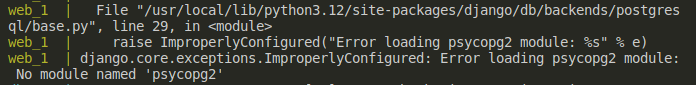
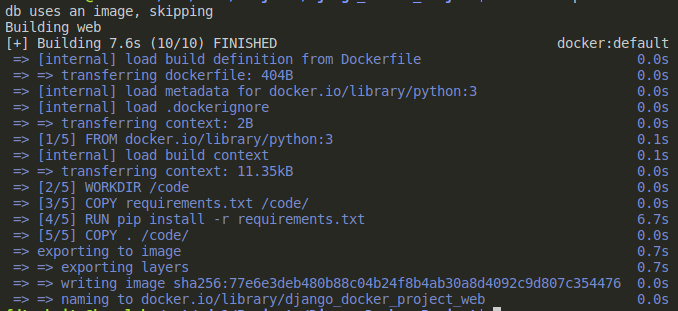
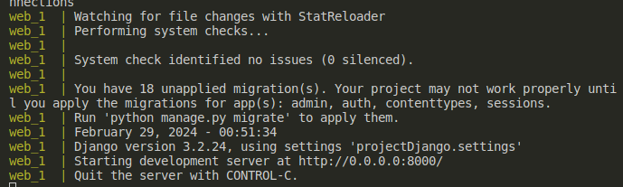
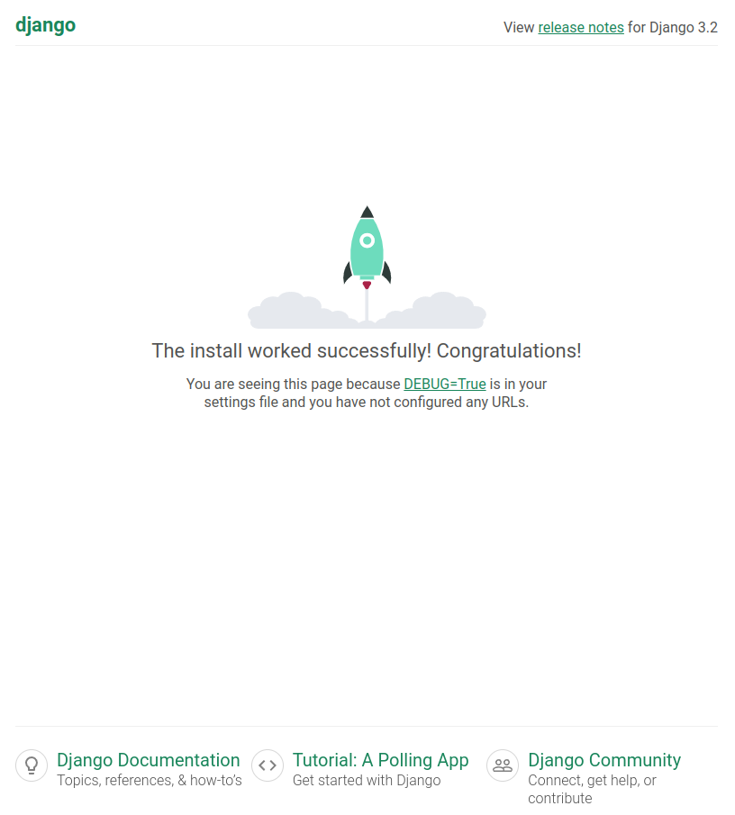
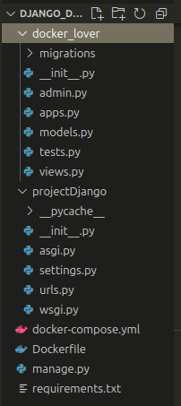
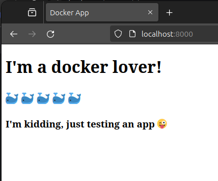

# Criando um container Docker de um sistema Django
<aside>
For english version, click [here](README-en.md)
</aside>

### Por que eu deveria criar um container dos meus apps?

Para os que estão iniciando, o Docker permite que você empacote sua aplicação em containers padronizados. Isso faz com que sua aplicação rode suavemente, independete do sistema operacional que ela esteja rodando. Além disso, containers são leves, permitindo escalar sua aplicação sempre que for preciso. É possível rodar diversos container em paralelo. E com a ajuda das ferramentas do Docker você pode gerenciar seus containers e automatizar o deploy das suas aplicações. 

O melhor de tudo é que suas aplicações rodarão de forma mais segura e isolada uma da outra. Com containers você pode ter certeza de que sua aplicação está rodando em um ambiente controlado, evitando qualquer potencial conflito ou falhas de segurança.

### Pré-requisitos

Para reprodução deste artigo será necessário a instalação dos seguintes softwares:

- Docker Engine - versão 25.0.3
    - Siga o passo-a-passo usando a [documentação oficial](https://docs.docker.com/engine/) para instalação.
- Docker Compose - versão 2.24.6
    - Siga o passo-a-passo usando a [documentação oficial](https://docs.docker.com/compose/install/) para instalação.

Além disso será necessário um editor de código e acesso ao Terminal. Neste artigo foi utilizado o VSCode rodando no sistema operacional Ubuntu 23.10

### Configurações iniciais

Inicialmente foi criado um diretório para nosso projeto chamado “Django_Docker_Project” e abert usando o VSCode.

Com o VSCode aberto, cria-se um arquivo chamado “Dockerfile”. Neste arquivo utiliza-se o código abaixo:

```docker
# Informa a imagem base
FROM python:3
# Define o ambiente
ENV PYTHONUNBUFFERED=1
# Esta será o diretorio onde nosso projeto irá rodar
WORKDIR /code
# Copia o arquivo de dependências do projeto para o diretório
COPY requirements.txt /code/
# Instala as dependências do arquivo
RUN pip install -r requirements.txt
# Copia os arquivos da raiz para o diretório
COPY . /code/ 
```

Feito isso, cria-se o arquivo “requirements.txt” dentro da raiz do projeto e adiciona-se o seguinte código:

```bash
#Informa a versão do Django que será instalada.
#Neste caso, maior que 3.0 e menor que 4.0
Django>=3.0,<4.0
```

Agora cria-se mais um arquivo chamado “docker-compose.yml”. Este arquivo descreve os serviços que compõe o seu app. Neste exemplo teremos dois tipos de serviços: Web Server e Database. Este arquivo então irá dizer qual as imagens estes serviços utilizam e como elas estão ligadas. Para isso, utiliza-se o seguinte código:

```yaml
version: "3.9"

# Determina os serviços necessários para o container
services:
# Seleciona o banco de dados Postgres
# Também informa as variáveis de ambiente
  db:
    image: postgres
    environment:
        - POSTGRES_DB=postgres
        - POSTGRES_USER=postgres
        - POSTGRES_PASSWORD=postgres
# Cria o ambiente web utilizando o localhost na porta 8000
# Também informa a pasta onde está o código do app
# E adiciona a dependência do serviço db
  web:
    build: .
    command: python manage.py runserver 0.0.0.0:8000
    volumes:
      - .:/code
    ports:
      - "8000:8000"
    depends_on:
      - db
  
# Observação: O Django utiliza nativamente o SQLite
# como banco de dados. Portanto, após criado o
# projeto, será necessário alterar o arquivo
# de configuração de SQLite para Postgres
```

Seu projeto deve estar desta forma:



### Criando o projeto Django

Com o arquivo YAML criado, o proximo passo é criar o projeto Django utilizando a imagem que acabou de ser configurada. No terminal, execute o seguinte comando.

```bash
# Substitua "projectDjango" pelo nome do seu projeto
docker-compose run web django-admin startproject projectDjango .
```

<aside>
 Observe que há um espaço e um ponto no final do comando. Isso representa a raiz de instalação do diretório do projeto. Caso não seja incluso, o docker irá criar uma nova pasta para este projeto.

</aside>

Durante este processo o docker-compose irá baixar as imagens e dependências do projeto. Ao termino de execução do script você deverá visualizar a seguinte mensagem no terminal:


Agora está presente na raiz o diretório “projectDjango” contendo os arquivos do projeto. Como mencionado anteriormente, será necessário configurar o banco de dados Postgres. Para isso abra o arquivo “settings.py”, presente dentro do diretório projectDjango.



Procure pela constante “DATABASES”, que deverá estar desta forma:



Será necessário alterar o código conforme abaixo:

```python
DATABASES = {
    'default': {
        'ENGINE': 'django.db.backends.postgresql',
        'NAME': 'postgres',
        'USER': 'postgres',
        'PASSWORD': 'postgres',
        'HOST': 'db',
        'PORT': 5432,
    }
}
```

Feito isso salve o arquivo e volte ao Terminal para executar o primeiro o teste do projeto que acabou de ser criado. Utilize o comando abaixo:

```bash
docker-compose up
```

É provável que o seguinte erro apareça durante a execução:



Isso significa que está faltando o módulo “psycopg2”, para corrigir isso será necessário instalar a dependência e atualizar a imagem docker. No terminal aperte Crtl+C para encerrar a aplicação.

Abra o arquivo “requirements.txt” e inclua a seguinte dependência abaixo do Django:

```python
#Informa a versão do Django que será instalada.
#Neste caso, maior que 3.0 e menor que 4.0
#Também instala o modulo psycopg2
Django>=3.0,<4.0
psycopg2-binary>=2.8
```

Agora atualize a imagem com o módulo faltante. No Terminal utilize:

```python
docker-compose build
```

Após a atualização, se tudo correr bem, você deverá ver a seguinte mensagem no Terminal:



<aside>
 Toda alteração que você vier a fazer no projeto será necessário atualizar a imagem docker. Para isso utilize o comando “docker-compose build” conforme apresentado.

</aside>

### Testando a aplicação

No Terminal use o seguinte comando:

```bash
docker-compose up
```

Se tudo estiver ok, você deverá ver a seguinte mensagem:



Isso significa que o servidor django está rodando e acessível em [http://localhost:8000/](http://localhost:8000/). Ao acessar o link você poderá confirmar que a instalação ocorreu com sucesso.



<aside>
🐳 Importante mencionar que esta aplicação está rodando dentro de uma imagem docker e sendo acessada a partir da porta 8000, conforme configuramos.

</aside>

### Criando um App no Docker

Pelo Terminal aperte Crtl+C para fechar o servidor. Agora, similar ao que foi feito no início do artigo, utiliza-se o docker-compose para criar um app para o servidor. Ainda no Terminal, utilize o seguinte script:

```bash
# Substitua "docker_lover" pelo nome do seu App
docker-compose run web python manage.py startapp docker_lover
```

Você verá um novo diretório na raiz do projeto com o nome do seu app.



Será necessário fazer algumas modificações no app. Dentro do diretório do seu app crie um diretório chamado “templates”. Dentro deste diretório crie um arquivo entitulado index.html. Neste arquivo utiliza-dr a seguinte estrutura:

```html

<!DOCTYPE html>
<html lang="en">

<head>
    <meta charset="UTF-8">
    <meta name="viewport" content="width=device-width, initial-scale=1.0">
    <title>Docker App</title>
</head>

<body>
    <u1>
        <h1>I'm a docker lover!</h1>
        <h2>🐳 🐳 🐳 🐳 🐳</h2>
        <h3>I'm kidding, just testing an app 😜</h3>
    </u1>
</body>

</html>
```

Salve e feche o arquivo. Abra o arquivo views.py presente no diretório do seu app e inclua o código abaixo:

```python
from django.shortcuts import render

# Create your views here.
def index(request):
    return render(request, "index.html")
```

Ainda no mesmo diretório, crie um arquivo chamado “urls.py” e adicione o código abaixo:

```python
from django.urls import path
from . import views

urlpatterns = [
    path("", views.index)
]
```

Feito isso, abra no diretório do projeto django o arquivo “settings.py”. Procure a constante “INSTALLED_APPS” e inclua o app recém criado, conforme abaixo:

```python
INSTALLED_APPS = [
    'django.contrib.admin',
    'django.contrib.auth',
    'django.contrib.contenttypes',
    'django.contrib.sessions',
    'django.contrib.messages',
    'django.contrib.staticfiles',
    'docker_lover',
]
```

Ainda no mesmo diretório, abra o arquivo “urls.py” e inclua dentro da variavel “urlpatterns” conforme abaixo. Não esqueça de adicionar a importação do módulo “include”. Deve ficar assim:

```python
from django.contrib import admin
from django.urls import path
from django.urls import include

urlpatterns = [
    path('admin/', admin.site.urls),
    path('', include('docker_lover.urls')),
]
```

Salve todos os arquivos para novamente atualizar a imagem do projeto. Desta vez, junto com a atualização, será rodado o app. No Terminal, utilize o comando:

```python
docker-compose up --build
```

Com o servidor ativo, acesse novamente [http://localhost:8000/](http://localhost:8000/). Se tudo estiver correto, você irá visualizar seu app rodando com sucesso no servidor:



### Conclusão

Neste artigo foi abordado como criar um container docker de um sistema django. Você pode acessar os arquivos deste artigo em meu [Github](https://github.com/fdtschmitz/Django_Docker_Project).

É inegável o poder e versatilidade de utilização de containers para aplicações. Espero que este artigo seja útil de alguma forma e possa contribuir com seus estudos.
